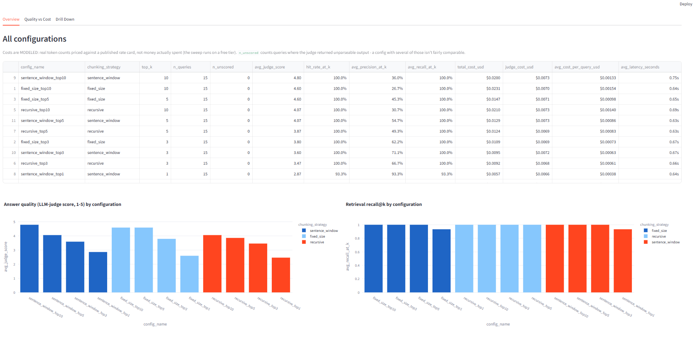
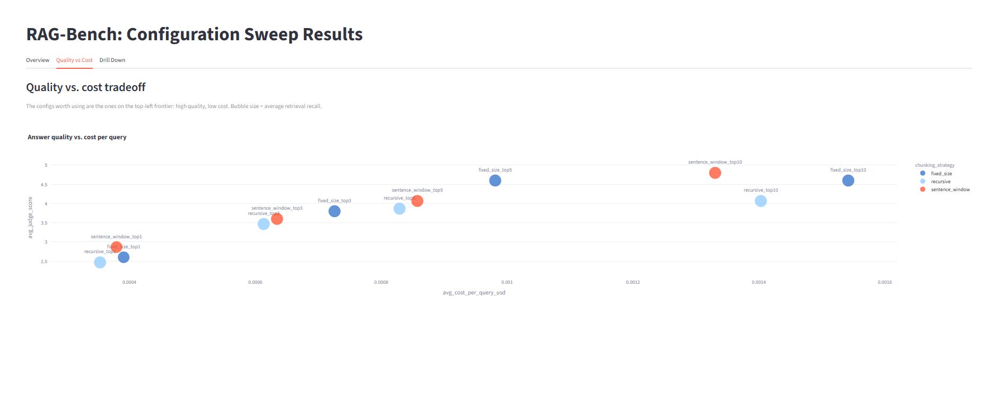
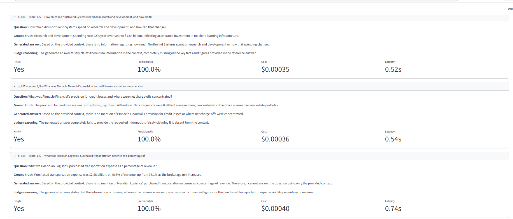

# RAG-Bench

I kept running into the same question while learning about RAG systems: how much do
the setup choices actually matter? Specifically, how you split documents into chunks,
and how many chunks you pull back for each question.

Most tutorials pick one approach and move on. I wanted to measure it instead.

So this runs the same set of questions through 12 different configurations and
compares them on answer quality, retrieval quality, and cost.

## The main thing I found

The retrieval metrics said every configuration was perfect. The answers said otherwise.

`recall@k` came back at 100% for every configuration once you retrieve 3 or more chunks.
But the answer quality scores across those same configurations ranged from 3.47 to 4.80
out of 5. So the metric that's supposed to tell you if retrieval is working couldn't
tell the difference between a setup that answers most questions and one that fails a
third of them.

The reason is that `hit@k` and `recall@k` are measured per document. They check whether
you retrieved a chunk from the right filing. They don't check whether you retrieved the
chunk that actually has the answer in it. If a document gets split into five chunks and
you grab the wrong three, retrieval still scores a perfect 100%.

That's worth knowing because those two metrics get reported on their own a lot.

## What it measures

| What | Metric | How |
|---|---|---|
| Retrieval | hit@k, precision@k, recall@k | plain math against labeled documents, no API call |
| Answer quality | 1-5 correctness score | LLM call grades the answer against the reference |
| Cost | tokens, dollars per query, latency | recorded on every API call |

A note on the cost numbers: I ran this on a free API tier, so I didn't actually spend
anything. The token counts are real. The dollar figures come from multiplying those
counts by published prices. So it's a modeled cost, not a bill I paid. I kept it in
dollars because that's the unit the tradeoff actually matters in.

A note on the grading: the judge compares the generated answer to a reference answer,
so it's measuring correctness, not faithfulness to the retrieved context. Those two
get mixed up a lot and they're different things. Also, by default the same model both
writes and grades the answers, which is a real weakness — models tend to like their
own phrasing. You can point `judge.model` at a different model in the config.

## Results

I ran 15 questions across all 12 configurations, so 180 question-configuration pairs.
Both generation and grading used `gemini-3.5-flash-lite`.



| Config | Judge score | Cost/query | Precision@k | Recall@k |
|---|---|---|---|---|
| sentence_window_top10 | 4.80 | $0.00133 | 36.0% | 100% |
| fixed_size_top10 | 4.60 | $0.00154 | 26.7% | 100% |
| fixed_size_top5 | 4.60 | $0.00098 | 45.3% | 100% |
| recursive_top10 | 4.07 | $0.00140 | 30.7% | 100% |
| sentence_window_top5 | 4.07 | $0.00086 | 54.7% | 100% |
| recursive_top5 | 3.87 | $0.00083 | 49.3% | 100% |
| fixed_size_top3 | 3.80 | $0.00073 | 62.2% | 100% |
| sentence_window_top3 | 3.60 | $0.00063 | 71.1% | 100% |
| recursive_top3 | 3.47 | $0.00061 | 66.7% | 100% |
| sentence_window_top1 | 2.87 | $0.00038 | 93.3% | 93.3% |

### Retrieving more stops helping at 5



`fixed_size_top5` and `fixed_size_top10` both scored 4.60. Same quality. But top-10
costs $0.00154 per query against $0.00098 for top-5. So you pay 57% more for nothing.

Two configurations were beaten on both quality and cost at once, meaning there's no
reason to pick either of them:

- `fixed_size_top10` (4.60, $0.00154) loses to `sentence_window_top10` (4.80, $0.00133)
- `recursive_top10` (4.07, $0.00140) loses to the same

If I had to pick one setup, it'd be `fixed_size_top5`. It gets 4.60 for $0.00098.
`sentence_window_top10` scores a bit higher at 4.80 but costs 36% more, which is only
worth it if accuracy matters more than budget.

### How many chunks you retrieve matters more than how you split them

Changing top-k while keeping the chunker fixed moved the score by 1.6 to 2.0 points.
Changing the chunker while keeping top-k fixed moved it by 0.33 to 0.73. So retrieval
depth is roughly three times more important than chunking strategy here.

I'm not going to claim one chunker beat the others. The gap between first and second
place is 0.20 points, which is 3 points spread across 15 questions. I ran this once,
so I have no idea how much of that is noise. The most I'll say is that recursive
chunking came in last at all four values of k, which is a hint but not proof.

### An example of a failure

This is query q_006 under `recursive_top3`:



The question asked how much Northwind Systems spent on R&D. The system retrieved three
chunks: one from the right document, and two from other companies' R&D sections. The
model looked at that and said it couldn't find Northwind's R&D spending in the context,
which was correct — the R&D paragraph for Northwind was in a chunk it never retrieved.

The metrics for that query: hit@k True, recall@k 1.0, precision@k 0.33, judge score 1/5.

Two of the three chunks weren't just useless, they were dangerous. They had real R&D
numbers attached to the wrong companies. A model that guessed instead of admitting it
didn't know would have reported Aventine's $3.41 billion as Northwind's. So retrieving
more chunks isn't free even when it's cheap — it puts wrong answers within reach.

Worth mentioning: every failed query in this run was the model saying it didn't know,
not the model making something up. I didn't see a single hallucinated number.

## Limitations

- I ran this once. Any difference smaller than about half a point is probably noise.
- 15 questions is enough to see the top-k effect. It's not enough to separate the
  three chunkers.
- The documents are synthetic (see below), so the scores don't compare to published
  FinanceBench results. Only the comparison between configurations is meaningful.
- Same model writes and grades the answers.
- Chunk size and overlap are fixed at 500/50. Those probably matter as much as the
  chunking strategy and I didn't test them.
- The sentence-window chunker splits sentences with a regex, which can trip on things
  like "$4.2 billion". Financial text is full of those. It didn't seem to hurt the
  scores, but I didn't verify that properly.
- Embeddings run locally with `all-MiniLM-L6-v2`. Cheap, but retrieval is limited by
  that model and I didn't test other embedding models.

## The data

`sample_data/financebench_synthetic.json` has 12 made-up company filings and 30
questions, set up the same way FinanceBench is. The companies and numbers are invented.

I built the corpus so it would actually test the variables. Documents have real
paragraph breaks, so paragraph-aware chunking behaves differently from fixed-size
splitting. Facts sit at different depths in each document, so how many chunks you
retrieve matters. And five questions need information from two filings at once.

To use real FinanceBench instead, download it from
[the FinanceBench repo](https://github.com/patronus-ai/financebench), convert it to
match the JSON structure in `sample_data/`, and point `corpus.path` in
`config/experiments.yaml` at the new file.

## Running it

```bash
python -m venv venv
source venv/bin/activate        # Windows: venv\Scripts\activate
pip install -r requirements.txt
cp .env.example .env            # then add an API key
```

It works with any OpenAI-compatible endpoint, so you can use Google AI Studio, Groq,
or anything similar. `.env.example` has the settings for each. Check what your key can
reach first:

```bash
python list_models.py           # what models your key can use
python test_key.py              # checks .env and makes one test call
```

Then run the sweep:

```bash
python -m src.runner --dry-run          # prints the 12 configs, no API calls
python -m src.runner --sample-size 2    # 2 questions each, quick check
python -m src.runner --sample-size 15   # the run above
python -m src.runner                    # all 30 questions
```

It saves after every single query, so if it gets interrupted you can just run it again
and it picks up where it stopped.

```bash
streamlit run dashboard/app.py
```

## A note on rate limits

I started this on `gemini-3.6-flash` and found out the free tier allows 20 requests
per day. The run needed about 360. Newer models tend to have tighter free limits than
older ones, which I didn't expect.

Switching to `gemini-3.5-flash-lite` (15 per minute, 500 per day) took three lines in
`.env` and no code changes, because every API call goes through one client in
`src/llm.py`. That file also spaces out requests to stay under the per-minute cap and
reads the retry delay out of rate-limit errors instead of guessing.

## Project layout

```
config/experiments.yaml           defines the 12 configs
sample_data/                      the synthetic corpus
src/llm.py                        one client for any OpenAI-compatible API
src/chunking.py                   the 3 chunking strategies
src/vectorstore.py                ChromaDB, local embeddings
src/generation.py                 answer generation and cost tracking
src/pipeline.py                   one config, end to end
src/evaluation.py                 retrieval metrics and the LLM judge
src/runner.py                     runs all 12 configs, resumable
dashboard/app.py                  Streamlit results viewer
results/published/                the run described above
```

## What I'd do next

- Run it several times to find out how much of the chunker difference is noise
- Use a different model for grading than for generation
- Label which chunk holds each answer, so hit@k measures what people assume it measures
- Sweep chunk size and overlap too
- Run it on real FinanceBench
